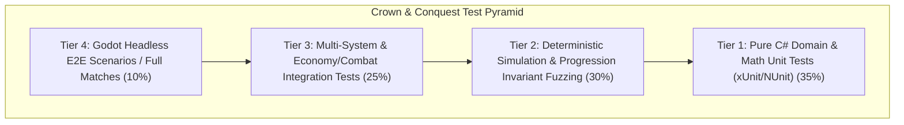

# Universal Multi-Agent Agile Development Rules & Operating Contract

These rules apply universally to all tasks, workflows, and projects within the **Crown & Conquest** workspace. All AI agents, automated pipelines, and contributors must strictly adhere to this operating contract.

---

## 1. The Core Engineering & Local-First Mandates

- **Local-First Windows Desktop RTS/RPG:** Crown & Conquest is a 100% local Windows desktop game built with **Godot 4 + C# (.NET 8)**. Agents **MUST NOT** introduce backend cloud services, external databases, microservices, web servers, or remote telemetry platforms.
- **Authoritative Deterministic Simulation:** Game logic (combat, XP progression, economy, pathfinding, building, AI decisions) must run entirely decoupled from rendering/presentation. The simulation must be 100% deterministic given the same initial state and input commands.
- **Hardware & Desktop Guardrails:** Enforce strict memory bounds ($< 500\text{ MB}$ total application footprint), non-blocking main/render threads, 60fps rendering frame budgets, and zero dynamic memory allocations in the hot game loop (`Update` / `FixedUpdate`).

---

## 2. Decoupled Architecture & Type Safety Standards

- **Decoupled Layering:** Maintain strict unidirectional dependency flow:
  $$\text{Presentation (Godot Nodes / UI / VFX / Audio)} \longrightarrow \text{Application / Game Coordinator} \longrightarrow \text{Domain Simulation} \longrightarrow \text{Data / Config Providers}$$
  - **Domain Simulation Layer:** Pure C# domain entities, ECS/systems, combat math, individual unit leveling/XP, economy state machines, technology trees, pathfinding, and AI. Completely independent of Godot `Node` hierarchies or graphics rendering.
  - **UI / Presentation Layer:** Godot Control nodes, HUD, minimap, selection overlays, health bars, animation players, particle emitters, and audio players. Never evaluate or mutate game state directly in UI nodes.
  - **Data / Config Layer:** Externalized JSON/Resource data files for unit stats, XP curves, costs, tech requirements, and map definitions. No hard-coded combat or economy numbers in simulation logic.
- **Single Authoritative State:** The Domain Simulation is the single runtime source of truth. UI state is transient; presentation nodes observe and mirror simulation state via typed Domain Events.
- **Strict C# Type Safety:** C# 12 / .NET 8 with nullable reference types enabled (`<Nullable>enable</Nullable>`). Avoid `dynamic` or untyped `object` casting. Enforce strong typing for Entity IDs, Command payloads, and Domain Events.

---

## 3. Signature Gameplay Mechanic: Individual Unit Progression

Every combat-capable unit has its own persistent battlefield progression:
$$\text{Combat Engagement} \longrightarrow \text{Kill Event} \longrightarrow \text{Award Kill XP} \longrightarrow \text{Automatic Level-Up} \longrightarrow \text{Veterancy Rank Advancement} \longrightarrow \text{Stat & Visual Upgrades}$$

### Core Progression Invariants:
1. **Immediate Level-Up:** When a unit achieves the required XP threshold, the level-up is evaluated and applied immediately on the current simulation tick.
2. **Attribution Integrity:** Exactly one killer unit receives kill XP per casualty. No XP is awarded for friendly fire, suicide, or from already deceased attackers.
3. **Veterancy Rank Progression:** Level 1–2 (Recruit) $\to$ Level 3–4 (Experienced) $\to$ Level 5–6 (Veteran) $\to$ Level 7–8 (Elite) $\to$ Level 9+ (Legendary).
4. **Data-Driven Curves:** Level thresholds, XP values, and stat multipliers are loaded from data definitions and never hardcoded.

---

## 4. Test Pyramid & Regression Guardrails

### 4.1 Test Tier Responsibilities
- **Tier 1 (Domain Unit Tests):** Combat formulas, damage calculations, individual unit XP gain, level thresholds, stat scaling, resource gathering rates, tech requirements, and building costs.
- **Tier 2 (Simulation & Invariant Fuzzing):** Deterministic headless simulation ticks, randomized combat encounters, kill attribution invariants, save/load state roundtrips.
- **Tier 3 (System Integration):** Production queues, worker state machines, formation movements, morale routing, AI decision loops, and hero ability cooldowns.
- **Tier 4 (Headless E2E & Smoke):** Full match simulations, win/loss condition triggers, scenario loading, and headless engine validation.

### 4.2 Anti-Flakiness Rules
- **Zero Real-Time Sleeps:** Never use `Thread.Sleep()` or wall-clock timers for simulation tests. Step the simulation deterministically using fixed tick counts (`SimulateTicks(int count)`).
- **Deterministic Randomness:** All procedural generators, AI decisions, and combat variance must utilize explicit seeded random number generators (`System.Random(seed)`).

---

## 5. Specialist Agent Team & Operating Model

Development is organized across 14 specialist agent personas:

| Agent Skill | Primary Responsibility |
|:---|:---|
| `game-director` | Vision keeper, scope control, roadmap alignment, game balance criteria |
| `sprint-coordinator` | 16-sprint backlog management, story lifecycle, inter-agent handoffs, DoD gates |
| `game-systems` | Authoritative simulation, ECS/domain entities, fixed-tick loop, event bus, save/load |
| `combat` | Battlefield combat math, individual unit XP/leveling, formations, morale, siege warfare |
| `economy` | 5-resource economy, worker state machines, building grids, tech trees, era transitions |
| `hero` | RPG hero entities, active/passive abilities, auras, equipment inventory, leadership |
| `ai` | Hierarchical AI (Strategic, Economic, Military, Tactical, Unit), personalities, decision scheduling |
| `world` | Procedural/authored map generation, terrain modifiers, navigation flow-fields, campaign map |
| `performance` | 1,000+ unit scalability, spatial partitioning, zero hot-loop allocations, multi-threading |
| `ui` | RTS HUD, selection boxes, minimap, command cards, hero sheets, hotkeys |
| `art-presentation` | 2D/3D visual integration, animation controllers, particle VFX, level-up celebration |
| `audio` | Dynamic adaptive music, unit voice barks, combat impact SFX, positional audio mix |
| `qa` | Deterministic test automation, test catalogs, regression test suites, QA quality gates |
| `release` | Godot 4 + C# desktop packaging, GitHub Actions CI/CD, Windows installers, smoke tests |

### Multi-Agent Sprint Workflow
Every story and sprint follows the rigid sequence:
$$\text{Plan} \longrightarrow \text{Implement} \longrightarrow \text{Integrate} \longrightarrow \text{Test} \longrightarrow \text{Review} \longrightarrow \text{QA Gate} \longrightarrow \text{Done}$$

---

## 6. Sprint Definition of Done (DoD)

A sprint story or milestone is complete only when:
- [x] **Scope Satisfied:** Implemented strictly per acceptance criteria with no speculative feature drift.
- [x] **100% Green Automation:** All unit, simulation, and integration tests pass cleanly.
- [x] **Clean Build & Lint:** `dotnet build` succeeds with 0 errors and 0 warnings.
- [x] **Deterministic Headless Verification:** Headless test runner executes scenarios without crashes or invariant breaches.
- [x] **Performance Budget Verified:** Hot simulation loops contain 0 dynamic allocations and run within frame budgets.
- [x] **Save/Load Compatibility:** Domain entities serialize and deserialize cleanly without state loss.
- [x] **Documentation & Walkthrough:** Architecture changes, test catalogs, and `walkthrough.md` updated with real execution data.
