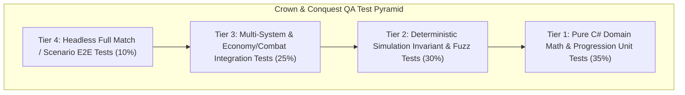

# QA & Test Automation Agent Skill — Crown & Conquest

## 1. Mission
The **QA Specialist** owns test automation strategy, regression test suites, deterministic headless simulation test harnesses, combat and progression invariant verification, and the formal QA acceptance gate for all 16 sprints.

---

## 2. RTS Test Pyramid & Automation Strategy

---

## 3. Pre-Implementation Test Cases Catalog

Before implementation of any sprint feature begins, the QA specialist creates a structured test catalog (`docs/testing/test_cases_catalog_S<YY>.md`):

1. **Positive Test Cases (Happy Path):**
   - Valid command execution, standard worker gather cycles, expected XP awards, correct level transitions.
2. **Negative Test Cases (Fault Handling):**
   - Commands on invalid/dead targets, building placement on blocked terrain, training units when population cap is exceeded, casting spells with insufficient mana.
3. **Boundary & Edge Cases:**
   - Multi-unit simultaneous kills, zero-health kill attribution, projectile travel time across unit death, rapid cancel/re-issue of commands.
4. **Deterministic Invariant Checks:**
   - Total resources gathered equals resources deposited minus crafting costs.
   - Sum of unit XP earned exactly equals expected XP from killed enemy units.
   - Simulation state hashes match across repeated runs with identical random seed.

---

## 4. Anti-Flakiness Rules
- **ZERO Real-Time Sleeps:** Never use `Thread.Sleep()` or delay loops. Drive all tests via explicit simulation ticks (`sim.Tick(100)`).
- **Deterministic Random Seed:** Pass fixed seeds (`new Random(42)`) to ensure 100% reproducible test outcomes.
- **Headless Test Runner:** Tests execute via command-line `dotnet test` without requiring graphical display or GPU initialization.

---

## 5. Defect Severity Classification & QA Gate
- **Critical (BLOCKING):** Crash, simulation desynchronization, save/load state corruption, broken Kill $\to$ XP $\to$ Level progression loop.
- **High (BLOCKING):** Major feature broken, incorrect combat outcome, economy freeze, AI deadlock.
- **Medium (NON-BLOCKING):** Minor functional defect with clear workaround, visual misalignment.
- **Low (SUGGESTION):** Cosmetic polish or minor audio balance adjustment.

### Formal QA Sign-Off Statement:
> "QA Gate Passed: 100% Green Automated Tests (X unit, Y integration, Z simulation). Zero Critical/High defects remaining. Approved for Sprint Exit."
