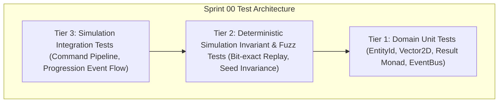

# Pre-Implementation QA Test Cases Catalog — Sprint 00: Engineering Foundation

**Document Version:** 1.0.0  
**Owner:** QA & Test Automation Specialist  
**Sprint:** Sprint 00 (Phase Foundation)  
**Status:** Approved for Implementation Gate  

---

## 1. Objective & Scope

This test cases catalog outlines the deterministic validation suite for **Sprint 00: Engineering Foundation**. All tests adhere to the **Crown & Conquest RTS Test Pyramid** and must execute headlessly via `dotnet test` with 0 real-time sleeps, fixed random seeds, and zero per-tick memory allocations in the hot simulation path.

---

## 2. Test Cases Specification

### 2.1 Tier 1: Domain Unit Tests (Pure C# / Math / Common)

| Test ID | Test Name | Target Component | Description & Acceptance Criteria | Expected Outcome |
|:---|:---|:---|:---|:---|
| **TC-S00-001** | `EntityId_EqualityAndHashing` | `EntityId` | Verify that `EntityId` implements structural equality, inequality, and hash code consistency as a `readonly record struct`. | Distinct IDs are not equal; same IDs produce identical hashes. |
| **TC-S00-002** | `FactionId_Validation` | `FactionId` | Verify that `FactionId` represents distinct player and neutral factions, disallowing negative identifiers. | Valid IDs match; invalid throws or returns error. |
| **TC-S00-003** | `Vector2D_ArithmeticAndDistance` | `Vector2D` | Test vector addition, subtraction, scalar multiplication, squared distance, and Euclidean distance without floating-point drift. | Mathematical correctness with epsilon $< 10^{-6}$. |
| **TC-S00-004** | `Vector2D_Normalization` | `Vector2D` | Test unit direction calculation; test zero-vector normalization returns `Vector2D.Zero` without `NaN` or division by zero. | Returns normalized direction vector or zero vector safely. |
| **TC-S00-005** | `Result_SuccessAndFailureMonad` | `Result<T, GameError>` | Verify success unwrapping (`Value`), failure unwrapping (`Error`), pattern matching, and guard against accessing `Value` on failure. | Safe error propagation without throwing uncaught exceptions. |
| **TC-S00-006** | `DomainEventBus_PublishAndSubscribe` | `DomainEventBus` | Register multiple typed handlers for `UnitSpawnedEvent` and `DamageDealtEvent`. Verify all subscribers receive dispatched events. | All registered handlers invoked in subscription order with correct event payloads. |
| **TC-S00-007** | `DomainEventBus_Unsubscribe` | `DomainEventBus` | Unsubscribe a handler and publish event. Verify unsubscribed handler is no longer invoked. | Unsubscribed handler receives 0 events. |
| **TC-S00-008** | `DomainEventBus_ZeroAllocationDuringDispatch` | `DomainEventBus` | Measure GC allocations during 10,000 dispatches of pooled/struct event records. | 0 bytes allocated on LOH or Gen0 during event broadcast. |

---

### 2.2 Tier 2: Deterministic Simulation Invariant & Fuzz Tests

| Test ID | Test Name | Target Component | Description & Acceptance Criteria | Expected Outcome |
|:---|:---|:---|:---|:---|
| **TC-S00-009** | `Simulation_BitExactReplay_IdenticalSeed` | `SimulationEngine` | Initialize two independent simulation instances with seed `12345`. Submit identical command sequences across 1,000 ticks. Compare state checksums. | State hash of Simulation A matches Simulation B bit-for-bit at every 100-tick interval. |
| **TC-S00-010** | `Simulation_SeedDivergence` | `SimulationEngine` | Initialize two simulation instances with seeds `12345` and `67890`. Execute identical randomized combat commands. | State hashes diverge deterministically within 50 ticks. |
| **TC-S00-011** | `Simulation_CommandQueue_TickOrderPreservation` | `CommandQueue` | Enqueue 50 commands from multiple factions during tick $T$. Step simulation to $T+1$. | Commands execute in strict deterministic order (by arrival timestamp, faction ID, entity ID). |
| **TC-S00-012** | `Simulation_ZeroDynamicAllocation_HotLoop` | `SimulationEngine` | Run 1,000 simulation ticks with 100 active units and measuring GC allocations across the tick step. | Zero Gen0 allocations during active simulation ticks. |

---

### 2.3 Tier 3: System & Progression Integration Tests

| Test ID | Test Name | Target Component | Description & Acceptance Criteria | Expected Outcome |
|:---|:---|:---|:---|:---|
| **TC-S00-013** | `Progression_KillXpAttribution_SingleKiller` | `UnitProgressionSystem` | Unit A deals lethal damage to Unit B. Verify XP is awarded solely to Unit A and `UnitGainedXpEvent` + `UnitKilledEvent` are emitted. | Killer receives exact unit kill XP. Casualty dies. Friendly/third-party units receive 0 XP. |
| **TC-S00-014** | `Progression_AutomaticLevelUp_Immediate` | `UnitProgressionSystem` | Unit gains XP exceeding Level 2 threshold. Verify level increases immediately on the current simulation tick. | Unit level becomes 2, stats increase according to curve, `UnitLevelUpEvent` is emitted. |
| **TC-S00-015** | `Progression_VeterancyRankTransitions` | `VeterancyState` | Level unit from 1 to 9 sequentially. Verify rank advances: Recruit (1-2) $\to$ Experienced (3-4) $\to$ Veteran (5-6) $\to$ Elite (7-8) $\to$ Legendary (9+). | Correct `VeterancyRank` assigned at each milestone with `VeterancyRankChangedEvent`. |
| **TC-S00-016** | `DataLoader_UnitAndXpDefinitions` | `DataLoader` | Load JSON definition files from `data/definitions/`. Verify schema integrity and numeric bounds. | All unit archetypes and XP curves load with valid non-zero stats and monotonic thresholds. |

---

## 3. QA Execution & Acceptance Criteria

1. **Automation:** 100% of test cases implemented in xUnit and executable via `dotnet test`.
2. **Deterministic Invariant Rule:** Zero real-time timers (`Thread.Sleep`, `Task.Delay`). All timing driven strictly by simulation ticks.
3. **Flakiness Threshold:** 0 flaky tests allowed across 10 consecutive full test runs.
4. **Sign-off Gate:** All 16 test cases must pass with 0 errors and 0 warnings before Sprint 00 sign-off.
