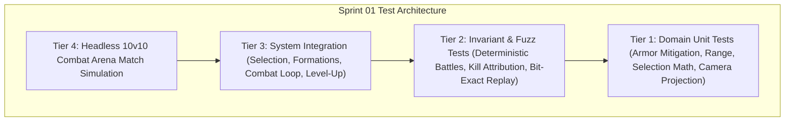

# Pre-Implementation QA Test Cases Catalog — Sprint 01: Playable Combat Vertical Slice

**Document Version:** 1.0.0  
**Owner:** QA & Test Automation Specialist  
**Sprint:** Sprint 01 (Phase RTS Prototype + Progression)  
**Status:** Approved for Implementation Gate  

---

## 1. Objective & Scope

This test cases catalog defines the exhaustive automated validation suite for **Sprint 01: Playable Combat Vertical Slice**. All tests conform to the **Crown & Conquest RTS Test Pyramid** and must execute headlessly via `dotnet test` with 0 real-time sleeps, fixed random seeds, and zero per-tick memory allocations in the hot simulation loop.

---

## 2. Test Cases Specification

### 2.1 Tier 1: Domain Unit Tests (Pure C# / Combat Math / Geometry)

| Test ID | Test Name | Target Component | Description & Acceptance Criteria | Expected Outcome |
|:---|:---|:---|:---|:---|
| **TC-S01-001** | `CombatMath_ArmorMitigation_Standard` | `CombatFormulas` | Verify $\text{Damage} = \max(1, \text{RawDamage} - \text{Armor})$ with various armor values. | $20\text{ damage} - 5\text{ armor} = 15\text{ effective damage}$. |
| **TC-S01-002** | `CombatMath_ArmorMitigation_MinimumFloor` | `CombatFormulas` | Test damage calculation when target armor equals or exceeds attacker damage. | Effective damage floors at minimum $1.0\text{ damage}$. |
| **TC-S01-003** | `Rect2D_ContainsAndIntersects` | `Rect2D` | Test 2D axis-aligned bounding box containment for points and intersection with other rectangles. | Accurately identifies points inside and outside marquee bounds. |
| **TC-S01-004** | `BattlefieldBounds_ClampPosition` | `BattlefieldBounds` | Test coordinate clamping to prevent entities from moving outside map borders ($[0, X_{max}], [0, Y_{max}]$). | Coordinates outside bounds are clamped to perimeter. |
| **TC-S01-005** | `RtsCamera_ScreenToWorldProjection` | `RtsCameraController` | Test screen coordinate to world coordinate transformation with zoom and offset. | World position accurately maps from viewport pixels. |
| **TC-S01-006** | `Veterancy_MultiLevelRollover` | `VeterancyState` | Award a massive single XP chunk ($1000\text{ XP}$) to a Level 1 unit. | Unit advances through intermediate levels sequentially, landing at the correct higher level (e.g. Level 5). |
| **TC-S01-007** | `UnitDefinition_Validation` | `DataLoader` | Verify loaded JSON unit definitions contain valid health, damage, range, speed, and positive XP values. | All 4 unit archetypes load cleanly with valid parameters. |

---

### 2.2 Tier 2: Deterministic Simulation Invariant & Fuzz Tests

| Test ID | Test Name | Target Component | Description & Acceptance Criteria | Expected Outcome |
|:---|:---|:---|:---|:---|
| **TC-S01-008** | `Simulation_10v10_BitExactReplay` | `SimulationEngine` | Run identical 10v10 battle across 2 simulation instances with identical seed (`42`). | Unit positions, health values, levels, and state hash match bit-for-bit after 500 ticks. |
| **TC-S01-009** | `Simulation_10v10_SeedDivergence` | `SimulationEngine` | Run 10v10 battle across 2 simulation instances with different seeds (`42` vs `99`). | Combat resolutions diverge deterministically. |
| **TC-S01-010** | `Progression_KillAttributionInvariant_TotalXpConserved` | `SimulationEngine` | Simulate a skirmish until 5 units die. Sum all XP earned by living units. | Total XP earned equals exactly the sum of `KillXpValue` of the 5 deceased units. |
| **TC-S01-011** | `Progression_NoFriendlyFireXp` | `SimulationEngine` | Simulate friendly unit casualty. | 0 XP awarded for friendly fire incidents. |
| **TC-S01-012** | `Progression_NoDeadAttackerXp` | `SimulationEngine` | A projectile in flight lands after the shooter has died. | Shooter receives 0 XP since shooter entity is no longer alive. |
| **TC-S01-013** | `Simulation_SpatialGrid_QueryCorrectness` | `SpatialGrid` | Query units in radius $R$ and box $B$; compare results against naive linear scan. | Spatial grid returns identical unit IDs with zero false positives or false negatives. |

---

### 2.3 Tier 3: System Integration Tests

| Test ID | Test Name | Target Component | Description & Acceptance Criteria | Expected Outcome |
|:---|:---|:---|:---|:---|
| **TC-S01-014** | `Selection_SinglePointSelection` | `SelectionManager` | Dispatch click at position containing Unit A. | Unit A is selected; other units are deselected. `UnitsSelectedEvent` published. |
| **TC-S01-015** | `Selection_DragBoxSelection_FiltersFaction` | `SelectionManager` | Drag box enclosing 5 friendly and 3 enemy units. | Only the 5 friendly units are selected. |
| **TC-S01-016** | `Movement_MultiUnitFormationSpacing` | `SimulationEngine` | Issue move order to 10 selected units towards destination $(50, 50)$. | Units travel in grid formation offsets without colliding or stacking on identical coordinates. |
| **TC-S01-017** | `Combat_MeleeEngagementAndCooldown` | `SimulationEngine` | Two melee units attack each other. Verify attack cooldown ticks elapse before next strike. | Strikes occur strictly every $N$ cooldown ticks. |
| **TC-S01-018** | `Combat_RangedEngagementAtRange` | `SimulationEngine` | Archer unit with range $8.0$ attacks melee unit from distance $6.0$. | Archer attacks without moving into melee range ($1.5$). |
| **TC-S01-019** | `Combat_AutoAcquireHostilesInAggroRange` | `SimulationEngine` | Enemy unit moves within agro radius of idle defensive unit. | Idle unit acquires hostile target and initiates combat. |
| **TC-S01-020** | `Progression_ImmediateLevelUp_StatIncrease` | `SimulationEngine` | Unit scores a kill, gains sufficient XP for Level 2. | Max health and damage increase immediately; current health scales proportionally. |
| **TC-S01-021** | `Progression_VeterancyRankPromotion_Events` | `SimulationEngine` | Unit reaches Level 3 (Experienced) and Level 5 (Veteran). | `VeterancyRankChangedEvent` emitted with correct old and new rank enums. |

---

### 2.4 Tier 4: Headless E2E & Combat Slice Scenario

| Test ID | Test Name | Target Component | Description & Acceptance Criteria | Expected Outcome |
|:---|:---|:---|:---|:---|
| **TC-S01-022** | `Scenario_10v10_FullBattleResolution` | `CombatArenaScenario` | Spawn 10 Celtic units (6 Swordsmen, 4 Archers) vs 10 Roman units (6 Legionaries, 4 Veles). Simulate until one side is victorious. | Battle resolves deterministically with clear victor, casualties recorded, killers leveled up, and 0 crashes or memory leaks. |
| **TC-S01-023** | `Scenario_UnitRoster_StatsReflection` | `CombatArenaPresenter` | Inspect presentation data after 10v10 skirmish. | Selected surviving units reflect leveled stats, kill counts, and rank badges matching simulation truth. |

---

## 3. QA Execution & Acceptance Criteria

1. **Automation:** 100% of test cases implemented in xUnit and executable via `dotnet test`.
2. **Deterministic Invariant Rule:** Zero real-time timers (`Thread.Sleep`, `Task.Delay`). All timing driven strictly by simulation ticks.
3. **Flakiness Threshold:** 0 flaky tests allowed across 10 consecutive full test runs.
4. **Sign-off Gate:** All 23 test cases must pass with 0 errors and 0 warnings before Sprint 01 sign-off.
