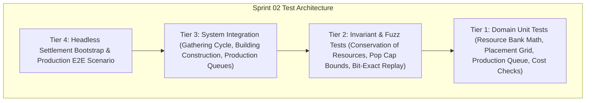

# Pre-Implementation QA Test Cases Catalog — Sprint 02: Economy Core

**Document Version:** 1.0.0  
**Owner:** QA & Test Automation Specialist  
**Sprint:** Sprint 02 (Phase Economy)  
**Status:** Approved for Implementation Gate  

---

## 1. Objective & Scope

This test cases catalog defines the exhaustive automated validation suite for **Sprint 02: Economy Core**. All tests conform to the **Crown & Conquest RTS Test Pyramid** and must execute headlessly via `dotnet test` with 0 real-time sleeps, fixed random seeds, and zero per-tick dynamic memory allocations in the hot simulation loop.

---

## 2. Test Cases Specification

### 2.1 Tier 1: Domain Unit Tests (Pure C# / Resource Math / Grid Placement)

| Test ID | Test Name | Target Component | Description & Acceptance Criteria | Expected Outcome |
|:---|:---|:---|:---|:---|
| **TC-S02-001** | `ResourceBank_DepositAndDeduct_CorrectBalances` | `ResourceBank` | Deposit various resource amounts into bank; verify balance updates. Deduct costs and verify balances. | Accurate resource totals across Food, Wood, Gold, Stone, Iron. |
| **TC-S02-002** | `ResourceBank_CanAfford_InsufficientResources` | `ResourceBank` | Test `CanAfford` check against single and multi-resource requirements when funds are insufficient. | Returns `false` without modifying balances if any resource is insufficient. |
| **TC-S02-003** | `ResourceCost_ZeroAndMultiResourceChecks` | `ResourceCost` | Test `ResourceCost` creation, equality, and validation with zero and positive amounts. | Properly constructs costs and prevents negative quantities. |
| **TC-S02-004** | `PlacementGrid_ValidAndInvalidPlacement` | `PlacementGrid` | Place buildings on empty grid cells, overlapping cells, and outside battlefield boundaries. | Allows valid non-overlapping placements; rejects overlapping or out-of-bounds attempts. |
| **TC-S02-005** | `ProductionQueue_EnqueueAndProgressTicks` | `ProductionQueue` | Enqueue items into production queue; advance simulation ticks; verify completion. | Items progress tick-by-tick and complete when required ticks elapse. |
| **TC-S02-006** | `PopulationManager_CapacityCalculation` | `PopulationManager` | Calculate total population cap based on Town Centers (+10) and Houses (+5). | Returns exact cumulative cap clamped to absolute maximum (e.g. 200). |
| **TC-S02-007** | `BuildingDefinition_Validation` | `DataLoader` | Verify loaded JSON building definitions for Town Center, House, Barracks, Storage Pit. | Definitions load with valid costs, hitpoints, construction time, footprint, and accepted drop-offs. |

---

## 2.2 Tier 2: Deterministic Simulation Invariant & Fuzz Tests

| Test ID | Test Name | Target Component | Description & Acceptance Criteria | Expected Outcome |
|:---|:---|:---|:---|:---|
| **TC-S02-008** | `Economy_ConservationOfResources_Invariant` | `SimulationEngine` | Workers harvest resources from a node until 100 units are extracted. Sum bank deposits + carried inventory + remaining node resource. | Total resources in system match initial node amount exactly (zero resource leak or duplication). |
| **TC-S02-009** | `Economy_WorkerInterruption_NoResourceLoss` | `SimulationEngine` | Interrupt a worker carrying 8 Wood by issuing a move order, then redirect to drop-off. | Worker retains carried inventory until deposited; 8 Wood deposited into stockpile. |
| **TC-S02-010** | `Economy_PopulationCap_StrictlyEnforced` | `SimulationEngine` | Attempt to train units when current population equals population cap. | Training command rejected or paused until housing is built. |
| **TC-S02-011** | `Economy_NodeDepletion_AutoRetargetNearestNode` | `SimulationEngine` | Workers harvest a tree until it is fully depleted. | Node transitions to Depleted state; workers automatically seek the nearest non-depleted tree. |
| **TC-S02-012** | `Economy_BitExactReplay_500Ticks` | `SimulationEngine` | Run identical settlement gathering and building simulation across 2 instances with seed `42`. | Bank balances, building construction percentages, and worker coordinates match bit-for-bit after 500 ticks. |

---

## 2.3 Tier 3: System Integration Tests

| Test ID | Test Name | Target Component | Description & Acceptance Criteria | Expected Outcome |
|:---|:---|:---|:---|:---|
| **TC-S02-013** | `Gathering_FullWorkerCycle_MoveHarvestReturnDeposit` | `SimulationEngine` | Issue gather command to worker on Gold Mine. Simulate full gathering loop. | Worker moves to mine $\to$ harvests 10 Gold $\to$ moves to Town Center $\to$ deposits $\to$ bank gold increases by 10 $\to$ returns to mine. |
| **TC-S02-014** | `Construction_SingleAndMultiWorkerBuilding` | `SimulationEngine` | Place Barracks blueprint ($100\text{ ticks}$ base). Assign 1 worker, then 3 workers. | Construction progress accelerates proportionally with multiple builders and completes with `BuildingCompletedEvent`. |
| **TC-S02-015** | `Production_TownCenter_VillagerTraining` | `SimulationEngine` | Queue villager training in Town Center with sufficient food. | Food deducted, production ticks elapse, new Villager entity spawns near Town Center, pop increases. |
| **TC-S02-016** | `Production_Barracks_SwordsmanTraining` | `SimulationEngine` | Construct Barracks, queue Swordsman training. | Resources deducted, swordsman spawns at Barracks rally point upon completion. |
| **TC-S02-017** | `DropOff_StoragePit_ResourceFiltering` | `SimulationEngine` | Worker gathering Wood deposits at nearest Storage Pit instead of distant Town Center. | Worker optimizes drop-off distance to nearest valid structure. |

---

## 2.4 Tier 4: Headless E2E Settlement Scenario

| Test ID | Test Name | Target Component | Description & Acceptance Criteria | Expected Outcome |
|:---|:---|:---|:---|:---|
| **TC-S02-018** | `Scenario_SettlementBootstrap_ToMilitaryProduction` | `SettlementEconomyScenario` | Fresh settlement starts with Town Center, 3 Villagers, starting resources. Villagers harvest Wood and Food, build a House and Barracks, and train 2 Swordsmen. | Full economic loop executes end-to-end headlessly; Barracks built; 2 Swordsmen produced; 0 invariant violations; 0 errors. |
| **TC-S02-019** | `Scenario_ResourceBarAndPlacementPresenter_Sync` | `SettlementEconomyPresenter` | Inspect presentation HUD and queue state during settlement execution. | Presenter state accurately mirrors simulation truth for resource counts, population cap, and construction/training cards. |

---

## 3. QA Execution & Acceptance Criteria

1. **Automation:** 100% of test cases implemented in xUnit and executable via `dotnet test`.
2. **Deterministic Invariant Rule:** Zero real-time timers (`Thread.Sleep`, `Task.Delay`). All timing driven strictly by simulation ticks.
3. **Flakiness Threshold:** 0 flaky tests allowed across 10 consecutive full test runs.
4. **Sign-off Gate:** All 19 test cases must pass with 0 errors and 0 warnings before Sprint 02 sign-off.
