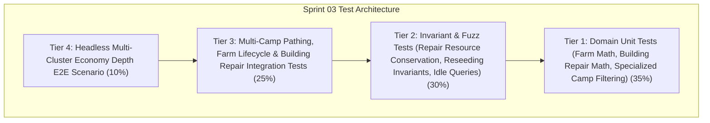

# Pre-Implementation QA Test Cases Catalog — Sprint 03: Economy Depth

**Document Version:** 1.0.0  
**Owner:** QA & Test Automation Specialist  
**Sprint:** Sprint 03 (Phase Economy)  
**Status:** Approved for Implementation Gate  

---

## 1. Objective & Scope

This test cases catalog defines the exhaustive automated validation suite for **Sprint 03: Economy Depth**. All tests conform to the **Crown & Conquest RTS Test Pyramid** and must execute headlessly via `dotnet test` with 0 real-time sleeps, fixed random seeds, and zero per-tick dynamic memory allocations in the hot simulation loop.

---

## 2. Test Cases Specification

### 2.1 Tier 1: Domain Unit Tests (Pure C# / Resource Math / Building Logic)

| Test ID | Test Name | Target Component | Description & Acceptance Criteria | Expected Outcome |
|:---|:---|:---|:---|:---|
| **TC-S03-001** | `Farm_FoodCapacityAndHarvest_Deduction` | `BuildingEntity` | Harvest Food from Farm entity; verify remaining food decreases accurately and reaches 0 when exhausted. | Farm tracks food depletion correctly without underflow. |
| **TC-S03-002** | `Farm_Reseeding_ReplenishesFood` | `BuildingEntity` | Reseed depleted Farm; verify remaining food is restored to max capacity (250 Food). | Farm becomes harvestable again with full capacity. |
| **TC-S03-003** | `BuildingRepair_MissingHealthAndCostProportions` | `BuildingEntity` | Calculate repair cost and health restoration for damaged building (50% HP). | Cost is proportional to missing HP (e.g. 50% of half build cost); HP increases up to MaxHealth. |
| **TC-S03-004** | `SpecializedCamps_AcceptedDropOffFiltering` | `BuildingEntity` | Verify `AcceptsDropOff` for Lumber Camp (Wood only), Mining Camp (Gold & Iron), Stone Quarry Camp (Stone only), Granary (Food only), Town Center (All 5). | Returns `true` only for designated resource types. |
| **TC-S03-005** | `WorkerGatherState_RepairAndFarmStates` | `WorkerGatherState` | Verify worker task state transitions for `MovingToRepair`, `Repairing`, and farm harvesting. | State machine updates correctly without losing carried resources. |

---

## 2.2 Tier 2: Deterministic Simulation Invariant & Fuzz Tests

| Test ID | Test Name | Target Component | Description & Acceptance Criteria | Expected Outcome |
|:---|:---|:---|:---|:---|
| **TC-S03-006** | `EconomyDepth_Repair_ResourceConservation_Invariant` | `SimulationEngine` | Damage building, assign workers to repair until 100% HP. Compare resources deducted from bank vs repair math. | Stockpile deductions exactly match theoretical repair costs; zero resource duplication or leaks. |
| **TC-S03-007** | `EconomyDepth_FarmReseed_WoodDeduction_Invariant` | `SimulationEngine` | Worker auto-reseeds exhausted farm. Sum bank Wood spent + farm reseed count * 60 Wood. | Exactly 60 Wood deducted per reseed; farm food resets to 250. |
| **TC-S03-008** | `EconomyDepth_IdleWorkerQuery_ExactCount` | `SimulationEngine` | Query idle workers across multiple factions with mixed active gatherers, builders, repairers, and idle villagers. | `GetIdleWorkers` returns bit-exact count and IDs of idle workers for that faction only. |
| **TC-S03-009** | `EconomyDepth_TaskSwitching_InventoryPreserved` | `SimulationEngine` | Reassign worker carrying 9 Gold from mining to building repair, then back to gold deposit. | Worker retains 9 Gold throughout task switching and deposits it when returning to drop-off. |
| **TC-S03-010** | `EconomyDepth_BitExactReplay_600Ticks` | `SimulationEngine` | Run 600 ticks of multi-cluster gathering, farming, and repair on two identical engines with seed `1337`. | Faction stockpiles, unit coordinates, farm capacities, and building healths match bit-for-bit. |

---

## 2.3 Tier 3: System Integration Tests

| Test ID | Test Name | Target Component | Description & Acceptance Criteria | Expected Outcome |
|:---|:---|:---|:---|:---|
| **TC-S03-011** | `Integration_LumberCamp_DropOffRouting` | `SimulationEngine` | Villager chops wood near Lumber Camp located 20 units away from Town Center. | Villager deposits Wood at nearby Lumber Camp, avoiding long trek to Town Center. |
| **TC-S03-012** | `Integration_MiningCamp_DualResourceRouting` | `SimulationEngine` | Place Mining Camp adjacent to Gold Deposit and Iron Node. Assign 1 gold miner and 1 iron miner. | Both miners deposit their respective resources at the shared Mining Camp. |
| **TC-S03-013** | `Integration_Granary_FarmAndBerryDropOff` | `SimulationEngine` | Place Granary near Berry Bushes and Farm. Farmers and foragers deposit food at Granary. | Food stockpile increases cleanly from both renewable farm and wild berry sources. |
| **TC-S03-014** | `Integration_BuildingRepair_MultiWorker` | `SimulationEngine` | Damaged Town Center (600/1200 HP). Assign 3 villagers to repair. | Health restores 3x faster; repairs halt when full HP reached; workers transition to idle. |
| **TC-S03-015** | `Integration_FarmDepletionAndAutoReseed` | `SimulationEngine` | Worker harvests farm to exhaustion with 100 Wood in stockpile. | Farm exhausts $\to$ auto-reseeds (60 Wood deducted) $\to$ farmer continues harvesting seamlessly. |

---

## 2.4 Tier 4: Headless Multi-Cluster Economy Depth E2E Scenario

| Test ID | Test Name | Target Component | Description & Acceptance Criteria | Expected Outcome |
|:---|:---|:---|:---|:---|
| **TC-S03-016** | `Scenario_EconomyDepth_MultiClusterAndRepair` | `EconomyDepthScenario` | Full scenario with 4 specialized outposts: Lumber Camp forest cluster, Mining Camp gold/iron cluster, Farmstead with Granary and Farms, Stone Quarry camp, plus damaged watchtower repair. | All 5 resources gathered efficiently via specialized camps; watchtower repaired to 100% HP; 0 invariant breaches in under 1,000 ticks. |
| **TC-S03-017** | `Scenario_EconomyDepthPresenter_DistributionSync` | `EconomyDepthPresenter` | Query presenter for worker task breakdown (Food, Wood, Gold, Stone, Iron, Builders, Repairers, Idle) throughout scenario execution. | Worker counts and camp statuses match authoritative simulation state at every tick. |

---

## 3. QA Execution & Acceptance Criteria

1. **Automation:** 100% of test cases implemented in xUnit and executable via `dotnet test`.
2. **Deterministic Invariant Rule:** Zero real-time timers (`Thread.Sleep`, `Task.Delay`). All timing driven strictly by simulation ticks.
3. **Flakiness Threshold:** 0 flaky tests allowed across 10 consecutive full test runs.
4. **Sign-off Gate:** All 17 test cases must pass with 0 errors and 0 warnings before Sprint 03 sign-off.
