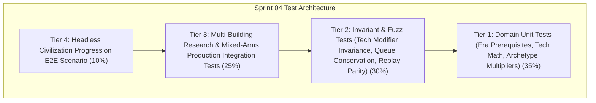

# Pre-Implementation QA Test Cases Catalog — Sprint 04: Eras & Technology

**Document Version:** 1.0.0  
**Owner:** QA & Test Automation Specialist  
**Sprint:** Sprint 04 (Phase Civilization)  
**Status:** Approved for Implementation Gate  

---

## 1. Objective & Scope

This test cases catalog defines the automated validation suite for **Sprint 04: Eras & Technology**. All tests conform to the **Crown & Conquest RTS Test Pyramid** and execute headlessly via `dotnet test` with 0 real-time sleeps, fixed random seeds, and zero per-tick dynamic memory allocations in the hot simulation loop.

---

## 2. Test Cases Specification

### 2.1 Tier 1: Domain Unit Tests (Pure C# / Era Logic / Tech Math / Combat Triangle)

| Test ID | Test Name | Target Component | Description & Acceptance Criteria | Expected Outcome |
|:---|:---|:---|:---|:---|
| **TC-S04-001** | `EraState_Advancement_ProgressionAndCompletion` | `EraState` | Initialize `EraState` at Archaic; start advancement to Classical (duration 100 ticks); advance 100 ticks; verify completion and era transition. | `CurrentEra` becomes `Classical`, `IsAdvancing` becomes `false`. |
| **TC-S04-002** | `EraManager_Prerequisites_Enforcement` | `EraManager` | Validate building prerequisites (e.g. Town Center + 2 Archaic buildings) and resource costs before advancing. | Rejects advancement if prerequisites or resources are insufficient; succeeds when satisfied. |
| **TC-S04-003** | `TechModifiers_CumulativeAggregation` | `FactionTechManager` | Unlock multiple technologies (`forging` +2 melee dmg, `iron_weapons` +3 melee dmg, `scale_armor` +2 armor); check cumulative modifiers. | Total melee bonus is +5, armor bonus is +2. |
| **TC-S04-004** | `ResearchQueue_Enqueue_Advance_Dequeue` | `ResearchQueue` | Enqueue research items; advance ticks until complete; dequeue finished item. | Progress increments accurately; item completes at exact duration; queue advances. |
| **TC-S04-005** | `CombatFormulas_SpearmanVsCavalry_BonusDamage` | `CombatFormulas` | Calculate effective damage of Spearman attacking Cavalry vs attacking Infantry. | Spearman inflicts 2.5x base damage against Cavalry, but standard damage against Infantry. |
| **TC-S04-006** | `CombatFormulas_ArcherRanged_TechModifierScaling` | `CombatFormulas` | Calculate Archer attack damage and range with and without `fletching` and `bodkin_arrow` upgrades. | Archer range and damage scale accurately according to researched tech modifiers. |

---

## 2.2 Tier 2: Deterministic Simulation Invariant & Fuzz Tests

| Test ID | Test Name | Target Component | Description & Acceptance Criteria | Expected Outcome |
|:---|:---|:---|:---|:---|
| **TC-S04-007** | `TechResearch_ResourceConservation_Invariant` | `SimulationEngine` | Start technology research, verify resources deducted from stockpile. Cancel research before completion; verify full/partial resource refund. | Exactly matching costs deducted on start and refunded on cancellation. |
| **TC-S04-008** | `EraAdvancement_TownCenter_LockoutInvariant` | `SimulationEngine` | Advance era at Town Center. Verify Town Center cannot queue workers while advancing age if configured as exclusive, or production and era advance concurrently. | Age advancement ticks deterministically; duplicate advancement requests are blocked. |
| **TC-S04-009** | `TechTree_PrerequisiteLock_Invariant` | `SimulationEngine` | Attempt to research Tier 2 technology (`iron_weapons`) without Tier 1 (`forging`) or while in Archaic Era. | Command is rejected; no resources deducted; tech remains unresearched. |
| **TC-S04-010** | `CombatTriangle_RockPaperScissors_Determinism` | `SimulationEngine` | Battle 10 Spearmen vs 5 Cavalry (Spearmen win), 10 Cavalry vs 10 Archers (Cavalry win), 10 Archers vs 10 Spearmen (Archers win). | Rock-paper-scissors dynamic functions consistently and deterministically. |
| **TC-S04-011** | `Civilization_DeterministicReplay_1000Ticks` | `SimulationEngine` | Run 1000 ticks of era advancement, tech research, building construction, and mixed-arms battle across two seeds. | State checksums match bit-for-bit at every tick milestone. |

---

## 2.3 Tier 3: System Integration Tests

| Test ID | Test Name | Target Component | Description & Acceptance Criteria | Expected Outcome |
|:---|:---|:---|:---|:---|
| **TC-S04-012** | `Integration_Blacksmith_UpgradeApplication_ActiveUnits` | `SimulationEngine` | Spawn existing Swordsmen and Archers. Complete `forging` and `scale_armor` at Blacksmith. Verify existing and newly spawned units receive stat boosts. | Existing and newly created units inherit updated faction combat stats. |
| **TC-S04-013** | `Integration_ArcheryRange_TrainingAndRangedCombat` | `SimulationEngine` | Construct Archery Range, train Archers, order them to attack enemy melee squad from range (8.0 tiles). | Archers attack from standoff distance without closing to melee; enemy takes damage. |
| **TC-S04-014** | `Integration_Stable_CavalryTrainingAndHighSpeedFlank` | `SimulationEngine` | Construct Stable in Classical Era, train Scout/Heavy Cavalry, verify movement speed (5.5) allows rapid repositioning and flanking. | Cavalry moves at high velocity and closes distance quickly. |
| **TC-S04-015** | `Integration_EraProgression_UnlocksNewBuildingsAndUnits` | `SimulationEngine` | Start in Archaic Era (Archery Range & Stable locked). Advance to Classical Era $\to$ verify Archery Range, Stable, and Blacksmith become buildable. | Era gating cleanly unlocks advanced military infrastructure. |

---

## 2.4 Tier 4: Headless Civilization Progression E2E Scenario

| Test ID | Test Name | Target Component | Description & Acceptance Criteria | Expected Outcome |
|:---|:---|:---|:---|:---|
| **TC-S04-016** | `Scenario_CivilizationProgression_FullEvolution` | `CivilizationProgressionScenario` | Full headless scenario: Gather resources $\to$ Advance from Archaic to Classical Era $\to$ Construct Blacksmith, Archery Range, Stable $\to$ Research Weapon/Armor techs $\to$ Train mixed army (Swordsmen, Archers, Cavalry, Spearmen) $\to$ Defeat enemy outpost. | Completes within 1,500 ticks with 0 invariant breaches and total victory. |
| **TC-S04-017** | `Scenario_CivilizationProgressionPresenter_HudSync` | `CivilizationProgressionPresenter` | Query presenter for Era banner state, active research progress, tech tree status, and unit stat preview throughout match. | Presenter mirrors authoritative domain state accurately with zero state drift. |
| **TC-S04-018** | `Data_Loaders_ErasAndTechnologies_Validation` | `DataLoader` | Load and validate `eras.json` and `technologies.json` from disk. | All definitions parse validly with proper prerequisites, costs, and modifiers. |

---

## 3. QA Sign-Off Criteria

1. **100% Green Automation:** All test cases must pass via `dotnet test`.
2. **Deterministic Simulation:** Zero real-time timers (`Thread.Sleep`, `Task.Delay`).
3. **Flakiness Threshold:** 0 flaky tests across 10 consecutive full runs.
4. **Memory Allocation Budget:** 0 heap allocations per tick in the simulation loop.
