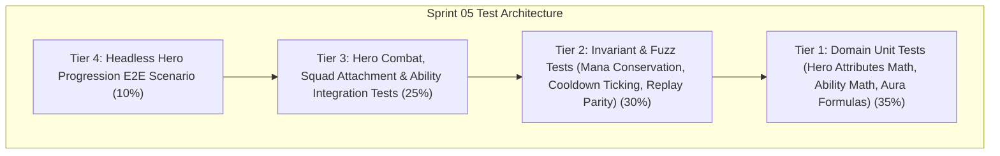

# Pre-Implementation QA Test Cases Catalog — Sprint 05: RPG Hero Layer

**Document Version:** 1.0.0  
**Owner:** QA & Test Automation Specialist  
**Sprint:** Sprint 05 (Phase Heroes)  
**Status:** Approved for Implementation Gate  

---

## 1. Objective & Scope

This test cases catalog defines the automated validation suite for **Sprint 05: RPG Hero Layer**. All tests conform to the **Crown & Conquest RTS Test Pyramid** and execute headlessly via `dotnet test` with 0 real-time sleeps, fixed random seeds, and zero per-tick dynamic memory allocations in the hot simulation loop.

---

## 2. Test Cases Specification

### 2.1 Tier 1: Domain Unit Tests (Pure C# / RPG Math / Ability Logic / Aura Formulas)

| Test ID | Test Name | Target Component | Description & Acceptance Criteria | Expected Outcome |
|:---|:---|:---|:---|:---|
| **TC-S05-001** | `HeroAttributes_DerivedStats_Scaling` | `HeroAttributes` | Validate that Strength scales MaxHealth and AttackDamage, Agility scales AttackSpeed, MoveSpeed, and Armor, and Willpower scales MaxMana, ManaRegen, and AbilityPotency. | Derived stat values strictly match mathematical formulas. |
| **TC-S05-002** | `HeroAbility_CostAndRange_Validation` | `HeroAbility` | Validate ability validation logic for mana cost sufficiency, cooldown status, and range requirements. | Fails if insufficient mana or on cooldown or out of range; passes when all constraints met. |
| **TC-S05-003** | `HeroAura_ModifierCalculation` | `HeroAura` | Verify aura calculations for bonus damage multiplier (+15%), armor (+2), and speed (+10%). | Applied modifiers correctly enhance base unit stats without permanent corruption. |
| **TC-S05-004** | `HeroLevel_AttributeGain_Progression` | `HeroState` | Trigger level-ups on hero state; verify attribute points and automatic attribute stat scaling per level. | Base attributes and derived statistics update immediately and accurately. |
| **TC-S05-005** | `CombatFormulas_HeroAuraCombatBonus` | `CombatFormulas` | Calculate effective damage dealt and received by a regular unit when inside vs outside a Hero's leadership aura. | Damage dealt is boosted by 15% and incoming damage is mitigated by aura armor bonus. |
| **TC-S05-006** | `HeroLeadership_CapacityCalculation` | `HeroState` | Verify leadership capacity scaling with level and strength attributes (`Capacity = 10 + Level*2 + STR/2`). | Capacity accurately reflects hero rank and strength. |

---

## 2.2 Tier 2: Deterministic Simulation Invariant & Fuzz Tests

| Test ID | Test Name | Target Component | Description & Acceptance Criteria | Expected Outcome |
|:---|:---|:---|:---|:---|
| **TC-S05-007** | `HeroMana_ConservationAndRegen_Invariant` | `SimulationEngine` | Cast abilities repeatedly until mana depleted. Verify mana is deducted exactly and regenerates at the specified rate per tick up to MaxMana. | Mana cannot drop below 0 or exceed MaxMana; regen is deterministic per tick. |
| **TC-S05-008** | `HeroCooldown_FixedTickCountdown_Invariant` | `SimulationEngine` | Cast an ability with 40-tick cooldown. Advance simulation 40 ticks. Verify cooldown decrements by exactly 1 per tick and becomes ready on tick 40. | CooldownRemaining reaches 0 at exact tick; cannot be cast prematurely. |
| **TC-S05-009** | `HeroSquad_CapacityEnforcement_Invariant` | `SimulationEngine` | Attempt to attach more units to a hero than the leadership capacity allows. | Excess attachment requests are rejected; squad count cannot exceed capacity. |
| **TC-S05-010** | `HeroFallen_AuraDisruption_Invariant` | `SimulationEngine` | Kill the hero in combat while squad units are attached. Verify all attached units immediately lose aura bonuses and squad link is broken. | Aura buffs clear immediately upon hero death. |
| **TC-S05-011** | `HeroProgression_DeterministicReplay_1000Ticks` | `SimulationEngine` | Run 1000 ticks of hero combat, squad maneuvers, ability casting, and level-ups across two identical runs. | State checksums match bit-for-bit at every tick milestone. |

---

## 2.3 Tier 3: System Integration Tests

| Test ID | Test Name | Target Component | Description & Acceptance Criteria | Expected Outcome |
|:---|:---|:---|:---|:---|
| **TC-S05-012** | `Integration_HeroSquad_FormationAndAuraBuffs` | `SimulationEngine` | Attach 6 swordsmen to a Celtic Warlord hero. Move squad into combat. Verify all attached units within 12.0 radius receive aura buffs. | Attached units deal higher damage and take less damage in live combat. |
| **TC-S05-013** | `Integration_HeroOffensiveAbility_AreaDamage` | `SimulationEngine` | Celtic Warlord casts `HeroicStrike` / `WarCry` into enemy cluster. Verify spell damage is dealt to enemies and emits `HeroAbilityCastEvent`. | Enemy units take AoE damage; casualties are recorded. |
| **TC-S05-014** | `Integration_HeroSupportAbility_AreaHeal` | `SimulationEngine` | Celtic Druid casts `EarthMend` near damaged friendly units. Verify friendly units recover health without exceeding MaxHealth. | Friendly units heal deterministically. |
| **TC-S05-015** | `Integration_HeroKillXP_LevelUpTrigger` | `SimulationEngine` | Hero defeats enemy units directly or via attached squad shared XP. Verify hero reaches XP threshold and triggers `HeroLevelUpEvent`. | Hero immediately advances level, gains attribute points, and heals level-up HP bonus. |

---

## 2.4 Tier 4: Headless Hero Progression E2E Scenario

| Test ID | Test Name | Target Component | Description & Acceptance Criteria | Expected Outcome |
|:---|:---|:---|:---|:---|
| **TC-S05-016** | `Scenario_HeroProgression_FullEvolution` | `HeroProgressionScenario` | Full headless scenario: Summon Celtic Warlord $\to$ Attach Swordsmen squad $\to$ March to contested outpost $\to$ Cast `WarCry` and `HeroicStrike` $\to$ Turn tide of battle $\to$ Level up from Level 1 to Level 3 $\to$ Eliminate enemy warband. | Scenario completes successfully with victory within 1,200 ticks and 0 invariant breaches. |
| **TC-S05-017** | `Scenario_HeroPresenter_HudSync` | `HeroPresenter` | Query presenter for Hero attributes (STR/AGI/WIL), Mana bar, XP bar, attached squad count, and ability cooldown overlays throughout match. | Presenter mirrors simulation state with 0 drift. |
| **TC-S05-018** | `Data_Loaders_HeroesAndAbilities_Validation` | `DataLoader` | Load and validate `heroes.json` and `abilities.json` from disk. | All definitions parse validly with proper stats, costs, and cooldowns. |

---

## 3. QA Sign-Off Criteria

1. **100% Green Automation:** All test cases must pass via `dotnet test`.
2. **Deterministic Simulation:** Zero real-time timers (`Thread.Sleep`, `Task.Delay`).
3. **Flakiness Threshold:** 0 flaky tests across 10 consecutive full runs.
4. **Memory Allocation Budget:** 0 heap allocations per tick in the simulation loop.
