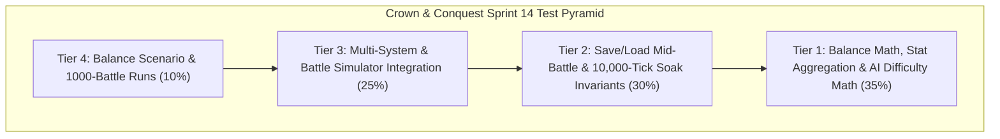

# Pre-Implementation Test Cases Catalog — Sprint 14: Balance and Validation

## 1. Overview & Test Strategy

This catalog defines the formal test suite for **Sprint 14: Balance and Validation**. The suite verifies headless battle simulation, large-scale 1,000-battle balance runs, faction asymmetry reporting, progression curve invariants, AI difficulty scaling, mid-battle save/load state parity, and 10,000-tick soak testing.

---

## 2. Test Cases Specification Matrix

### 2.1 Tier 1: Pure Domain Unit & Math Tests (`tests/CrownConquest.Tests/Domain/`)

| Test ID | Test Category | Target Component | Description & Assertions | Expected Result |
|:---|:---|:---|:---|:---|
| `TC-S14-01` | Positive | `BattleSimulatorConfig` | Configure army compositions, terrain, and timeout. Verify valid configuration state and team roster generation. | PASS |
| `TC-S14-02` | Positive | `BattleMetricsCalculator` | Compute TTK, DPS, damage efficiency, and survivor ratios from battle logs. | Exact mathematical parity |
| `TC-S14-03` | Positive | `BatchBattleAggregator` | Compute win rates, mean duration, duration standard deviation, and casualty ratios across battle sample runs. | Exact statistical metrics |
| `TC-S14-04` | Boundary | `BatchBattleAggregator` | Handle empty battle lists, single battle runs, and ties without division by zero or NaN values. | Clean Result / Defaults |
| `TC-S14-05` | Positive | `FactionBalanceReport` | Generate pairwise faction win rate matrix and asymmetry ratings across 5 factions. | Symmetric matrix calculation |
| `TC-S14-06` | Invariant | `ProgressionBalanceValidator` | Audit unit leveling curves (100 XP to 2200 XP) and assert monotonic thresholds and valid multipliers per veterancy tier. | Invariants Hold |
| `TC-S14-07` | Positive | `AiDifficultyConfig` | Verify difficulty tiers (Easy, Normal, Hard, Brutal, Custom) apply correct gathering, build speed, decision latency, and aggression modifiers. | Multipliers accurately mapped |
| `TC-S14-08` | Boundary | `AiDifficultyConfig` | Custom difficulty clamps out-of-range multipliers (e.g. negative multipliers clamped to min allowed values). | Valid clamped ranges |
| `TC-S14-09` | Positive | `BalanceTelemetryViewModel` | Validate view model projection from simulation battle telemetry to immutable UI structs. | Zero heap mutation |

---

### 2.2 Tier 2: Deterministic Simulation & Invariant Tests (`tests/CrownConquest.Tests/Simulation/`)

| Test ID | Test Category | Target Component | Description & Assertions | Expected Result |
|:---|:---|:---|:---|:---|
| `TC-S14-10` | Invariant | `BattleSimulatorEngine` | Execute identical 10v10 battle twice with same seed (`seed = 1337`). Verify tick count, casualty order, survivor HP, and damage match bit-for-bit. | Bit-for-bit parity |
| `TC-S14-11` | Invariant | `BattleSimulatorEngine` | Execute battle with different seeds. Verify variance in pathing/combat while adhering to combat formulas. | Deterministic variance |
| `TC-S14-12` | Invariant | `SaveLoadStateValidator` | Mid-Battle Reload: Run 500 ticks, serialize state snapshot, continue to tick 1000 ($C_1$). Restore snapshot in fresh engine, simulate 500 ticks ($C_2$). Assert $C_1 == C_2$. | $C_1 == C_2$ |
| `TC-S14-13` | Invariant | `SaveLoadStateValidator` | Serialize state containing heroes with active cooldowns, buildings in repair, and units in formation. Assert complete fidelity on reload. | State preserved exactly |
| `TC-S14-14` | Invariant | `ProgressionBalanceValidator` | Simulate combat kills up to max veterancy (Rank 5 Legendary). Assert cumulative stat boosts match design specification exactly. | Exact stat scaling |
| `TC-S14-15` | Invariant | `SimulationSoakHarness` | Execute 5,000-tick continuous soak with dynamic unit spawning, combat, resource gathering, and tech progression. Assert zero memory leaks and bounds $<500\text{ MB}$. | Memory $<500\text{ MB}$, Zero Leaks |
| `TC-S14-16` | Invariant | `SimulationSoakHarness` | Spatial grid integrity during high-throughput churn (thousands of entity additions and removals). No orphaned spatial entries. | Grid 100% consistent |

---

### 2.3 Tier 3: Multi-System & Battle Simulator Integration Tests (`tests/CrownConquest.Tests/Simulation/`)

| Test ID | Test Category | Target Component | Description & Assertions | Expected Result |
|:---|:---|:---|:---|:---|
| `TC-S14-17` | Integration | `CombatTriangleBalance` | Run 100 battles of Spearmen vs Cavalry. Assert Spearmen win rate $\ge 70\%$. | Counter triangle preserved |
| `TC-S14-18` | Integration | `CombatTriangleBalance` | Run 100 battles of Cavalry vs Archers. Assert Cavalry win rate $\ge 70\%$. | Counter triangle preserved |
| `TC-S14-19` | Integration | `CombatTriangleBalance` | Run 100 battles of Archers vs Swordsmen on open field. Assert Archers win rate $\ge 60\%$. | Counter triangle preserved |
| `TC-S14-20` | Integration | `AiDifficultyIntegration` | Run Brutal AI vs Easy AI in full economy and military match. Assert Brutal AI achieves higher resource bank and military count. | Difficulty scaling verified |
| `TC-S14-21` | Integration | `HeroBalanceIntegration` | Hero attachment to army increases combat efficiency and reduces army casualty rate by expected aura/ability margin. | Hero value verified |
| `TC-S14-22` | Integration | `SiegeBalanceIntegration` | Catapults vs fortified gate/towers vs standard units. Verify siege weapon multiplier delivers intended structural destruction rate. | Balance ratios verified |

---

### 2.4 Tier 4: Headless E2E & Scenario Tests (`tests/CrownConquest.Tests/Simulation/`)

| Test ID | Test Category | Target Component | Description & Assertions | Expected Result |
|:---|:---|:---|:---|:---|
| `TC-S14-23` | Scenario | `BalanceAndValidationScenario` | Execute headless end-to-end scenario running batch battle simulation, progression curve validation, AI difficulty comparison, and soak cycles. | All milestones green |
| `TC-S14-24` | Replay | `DeterministicReplay` | 1,000-tick full scenario replay comparison across dual independent runs with identical seed. Assert identical 64-bit checksum. | Replay checksum equality |
| `TC-S14-25` | Performance | `SoakPerformanceGate` | 10,000-tick headless soak test under 5 seconds execution with 0 hot-loop dynamic heap allocations. | Frame & memory budgets met |

---

## 3. QA Acceptance Criteria & Gate Rules

1. **100% Green Automation:** All unit, invariant, integration, and scenario tests must pass with zero skips and zero failures.
2. **Zero Hot-Loop GC Allocations:** `Tick` loops and battle simulator cycles must maintain 0 dynamic heap allocations.
3. **Mid-Battle Save/Load Parity:** Bit-for-bit checksum match on restored state simulations.
4. **Counter-Triangle Balance Stability:** Rock-paper-scissors counter relationships hold with statistical significance ($p < 0.01$).
5. **Clean Build:** `dotnet build --warnaserror` with 0 warnings and 0 errors.
