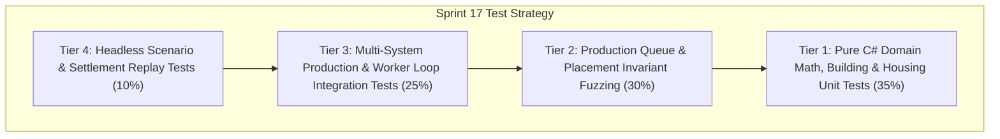

# Test Cases Catalog — Sprint 17: Interactive Building Production, Worker Gathering Loop & Settlement Placement

## 1. Scope & Test Pyramid Overview

This catalog defines the pre-implementation test matrix for **Sprint 17**, validating interactive building selection, production action cards, production queues with refund cancellation, rally point marching, worker autonomous gathering loops, grid-aligned blueprint placement, and dynamic population housing mechanics.

---

## 2. Test Case Matrix

### 2.1 Tier 1: Pure Domain & Housing Math Tests (Unit Tests)

| Test ID | Test Method / Scope | Preconditions | Inputs / Actions | Expected Results |
|:---|:---|:---|:---|:---|
| `TC_S17_001` | `BuildingSelection_PointClick_SelectsBuilding` | Town Center at $(40, 40)$, size $(4,4)$ | `SelectPoint(new Vector2D(40, 40))` | `SelectedBuildingId` equals Town Center ID, unit selection cleared. |
| `TC_S17_002` | `BuildingSelection_ClickGround_DeselectsBuilding` | Town Center selected | `SelectPoint(new Vector2D(100, 100))` on empty ground | `SelectedBuildingId` is null, selection is empty. |
| `TC_S17_003` | `BuildingSelection_ClickUnit_DeselectsBuilding` | Town Center selected, Swordsman at $(35, 55)$ | `SelectPoint(new Vector2D(35, 55))` | `SelectedBuildingId` is null, Swordsman is selected. |
| `TC_S17_004` | `ProductionActionCards_TownCenter_OffersVillagerAndEra` | Town Center selected, Classical Era | Query Town Center Action Card | Displays Train Villager (50 Food) and Advance Era options. |
| `TC_S17_005` | `ProductionActionCards_Barracks_OffersSwordsmanAndArcher` | Barracks selected | Query Barracks Action Card | Displays Train Swordsman (60F/20W) and Train Archer (50F/40W). |
| `TC_S17_006` | `ProductionActionCards_Blacksmith_OffersForgedBladesAndScaleArmor` | Blacksmith selected | Query Blacksmith Action Card | Displays Forged Blades (+2 Melee Dmg) and Scale Armor (+2 Armor). |
| `TC_S17_007` | `PopulationCapacity_HousesIncreaseCapBy5` | Town Center (+15 base), 3 completed Houses | Calculate population capacity | Capacity equals $15 + (3 \times 5) = 30$. |
| `TC_S17_008` | `PopulationBreakdown_CalculatesWorkersAndMilitary` | 4 Villagers, 8 Swordsmen, 1 Hero | Query population breakdown | Occupied = 13 (Military: 9, Workers: 4). |

### 2.2 Tier 2: Production Queue & Placement Invariant Tests (Simulation & Fuzzing)

| Test ID | Test Method / Scope | Preconditions | Inputs / Actions | Expected Results |
|:---|:---|:---|:---|:---|
| `TC_S17_009` | `ProductionQueue_EnqueueDeductsResourcesImmediately` | 500 Food, Barracks enqueues Swordsman (60F, 20W) | Dispatch `QueueProductionCommand` | Food drops to 440, Wood drops to 480; Queue count = 1. |
| `TC_S17_010` | `ProductionQueue_MaxQueueSizeCappedAt5` | Barracks has 5 items queued | Dispatch 6th `QueueProductionCommand` | Enqueue fails, resources not deducted, queue count remains 5. |
| `TC_S17_011` | `ProductionQueue_CancelRefunds100PercentResources` | Barracks has queued Swordsman (60F, 20W) | Dispatch `CancelProductionCommand(index: 0)` | Food restored +60, Wood +20, Queue count = 0. |
| `TC_S17_012` | `ProductionQueue_ProgressAdvancesEachTick` | Item with 100 ticks duration | Advance simulation 50 ticks | Progress is exactly $0.50$ ($50\%$). |
| `TC_S17_013` | `ProductionQueue_CompletionSpawnsUnitAndFiresEvent` | Barracks queues Swordsman | Run simulation until completion ticks | New Swordsman entity added to state, `ProductionCompletedEvent` emitted. |
| `TC_S17_014` | `BuildingPlacement_ValidBlueprint_AllowsPlacement` | Clear ground at $(60, 60)$, 150 Wood in bank | Evaluate `BuildingPlacementPreview` for Barracks | `IsValid == true`, `IsGridValid == true`, `CanAfford == true`. |
| `TC_S17_015` | `BuildingPlacement_ObstructedBlueprint_RejectsPlacement` | Existing building at $(40, 40)$ | Evaluate `BuildingPlacementPreview` at $(40, 40)$ | `IsValid == false`, `IsGridValid == false`. |
| `TC_S17_016` | `BuildingPlacement_InsufficientResources_RejectsPlacement` | 0 Wood in bank | Evaluate `BuildingPlacementPreview` for House (50 Wood) | `IsValid == false`, `CanAfford == false`. |

### 2.3 Tier 3: Multi-System & Worker Loop Integration Tests (Integration)

| Test ID | Test Method / Scope | Preconditions | Inputs / Actions | Expected Results |
|:---|:---|:---|:---|:---|
| `TC_S17_017` | `RallyPoint_SpawnsUnitAndMarchesToRallyPoint` | Barracks rally point set to $(80, 80)$ | Complete unit training in Barracks | Newly spawned unit has target destination $(80, 80)$ and marches. |
| `TC_S17_018` | `RallyPoint_ResourceNode_AssignsWorkerToGather` | Town Center rally point set to Gold Mine | Complete Villager training | Newly spawned Villager automatically targets Gold Mine and starts gathering. |
| `TC_S17_019` | `WorkerGatherLoop_HarvestsUntilCapacityAndDeposits` | Villager at $(40, 40)$, Tree at $(45, 40)$, Town Center at $(40, 40)$ | Issue `GatherCommand` | Villager walks to tree, harvests 10 Wood, walks to Town Center, deposits +10 Wood, returns to tree. |
| `TC_S17_020` | `WorkerGatherLoop_DepletedNode_TransitionsToNearestOrIdle` | Tree with 5 Wood remaining | Worker harvests node until depleted | Node removed, worker searches for nearest tree or enters idle state without freezing. |
| `TC_S17_021` | `BuildingConstruction_VillagersBuildFoundationToCompletion` | Foundation placed at $(50, 50)$ ($10\%$ health) | Assign 2 Villagers to construct | Health & build progress increase per tick until $100\%$; `BuildingCompletedEvent` emitted. |
| `TC_S17_022` | `HousingCap_BlocksTrainingWhenPopCapped` | Population at $15/15$ | Attempt to queue Celtic Villager | Blocked with "Population Cap Reached" error; no resources deducted. |

### 2.4 Tier 4: Headless Scenario & Replay Parity (E2E & Determinism)

| Test ID | Test Method / Scope | Preconditions | Inputs / Actions | Expected Results |
|:---|:---|:---|:---|:---|
| `TC_S17_023` | `SettlementInteractiveScenario_FullEconomyLoop` | Graphical scenario with Town Center, Barracks, 4 Villagers | Run 1,000 simulation ticks with active harvesting & training | Resources deposited, units trained, 0 crashes, 0 state leaks. |
| `TC_S17_024` | `SettlementScenario_ReplayChecksumParity_1000Ticks` | Dual identical seeds ($42$) | Step both simulations 1,000 ticks | State checksums match bit-for-bit. |

---

## 3. Defect Severity & Pass Criteria
- **Pass Criteria:** $24 / 24$ tests passing ($100\%$ green), zero regressions across all historical tests ($339+$ tests), zero compiler warnings (`--warnaserror`).
