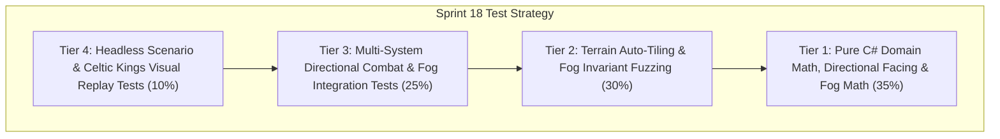

# Test Cases Catalog — Sprint 18: Celtic Kings 2D Sprite Art, Directional Unit Animation & Terrain

## 1. Scope & Test Pyramid Overview

This catalog defines the pre-implementation test matrix for **Sprint 18**, validating authentic Celtic Kings 2D sprite presentation, multi-layered terrain tilemaps with auto-tiling and speed modifiers, illustrated building sprites across 3 construction stages with damage VFX, 8-directional animated unit controllers with weapon trails, interactive natural resource foliage with persistent stumps and sparkling veins, and dynamic line-of-sight Fog of War shading.

---

## 2. Test Case Matrix

### 2.1 Tier 1: Pure Domain & Math Unit Tests

| Test ID | Test Method / Scope | Preconditions | Inputs / Actions | Expected Results |
|:---|:---|:---|:---|:---|
| `TC_S18_001` | `DirectionalFacing_FromHeading_Maps8DirectionsAccurately` | Heading vectors for all 8 cardinal & diagonal angles | Evaluate `FacingDirection.FromHeading(vec)` | Correct `FacingDirection` enum (North, NorthEast, East, SouthEast, South, SouthWest, West, NorthWest) returned. |
| `TC_S18_002` | `DirectionalFacing_ZeroHeading_DefaultsToSouth` | Heading vector $(0, 0)$ | Evaluate `FacingDirection.FromHeading(Vector2D.Zero)` | Returns default facing `South`. |
| `TC_S18_003` | `TerrainGrid_SpeedMultiplier_ReturnsCorrectValuesForTileTypes` | Terrain map with Grass, Road, Forest, Marsh, Cliff | Query `GetMovementMultiplier(pos)` for each tile | Grass $= 1.0$, Cobblestone Road $= 1.25$, Forest $= 0.80$, Marsh $= 0.60$, Cliff/Water $= 0.0$. |
| `TC_S18_004` | `TerrainGrid_Passability_BlocksCliffsAndDeepWater` | Terrain coordinates for Cliff and Deep Water | Query `IsPassable(pos)` | Returns `false` for Cliff and Deep Water, `true` for Grass and Road. |
| `TC_S18_005` | `BuildingConstructionStage_MapsProgressRangesAccurately` | Building entities with $15\%$, $65\%$, and $100\%$ health/progress | Evaluate `BuildingSpriteVisualMapper.GetStage(b)` | $15\% \to \text{Scaffolding}$, $65\% \to \text{HalfBuilt}$, $100\% \to \text{Completed}$. |
| `TC_S18_006` | `BuildingDamageVfxState_MapsHealthThresholdsToSmokeAndFire` | Building entities with $100\%$, $45\%$, and $15\%$ health | Evaluate `BuildingSpriteVisualMapper.GetDamageVfxState(b)` | $100\% \to \text{None}$, $45\% \to \text{LightSmoke}$, $15\% \to \text{HeavyFireAndSmoke}$. |
| `TC_S18_007` | `FoliageResource_DepletionRatio_CalculatesShrinkAndStumpTransitions` | Tree (Wood) at $100\%$ vs $0\%$, Gold Mine at $50\%$ | Evaluate `FoliageResourcePresenter.GetState(node)` | Tree at 0 Wood becomes `TreeStump`; Gold Mine at $50\%$ has scale $= 0.75$ and active sparkle phase. |
| `TC_S18_008` | `FogOfWar_InitialState_AllTilesUnexploredBlack` | Newly initialized `FogOfWarSystem(100, 100)` | Query all cells in fog grid | All cells have `FogState.Unexplored` (Black Shroud). |

### 2.2 Tier 2: Auto-Tiling & Fog Invariant Fuzzing Tests

| Test ID | Test Method / Scope | Preconditions | Inputs / Actions | Expected Results |
|:---|:---|:---|:---|:---|
| `TC_S18_009` | `TerrainAutoTiling_BitmaskCalculation_Calculates4BitAnd8BitMasks` | Road tile at $(10, 10)$ connected North and East | Evaluate `ComputeAutoTileBitmask(10, 10, Road)` | Bitmask correctly reflects North (1) + East (2) = 3 for corner connection. |
| `TC_S18_010` | `TerrainShoreline_WavePhase_CyclesSmoothly0To1` | `TerrainTileGrid` simulation ticks | Step simulation 20 ticks | `WavePhase` advances deterministically and wraps modulo 1.0. |
| `TC_S18_011` | `FogOfWar_VisionRadiusStamping_SetsAlliedRadiusToVisible` | Allied Town Center at $(40, 40)$, vision radius 20 tiles | Call `UpdateVision(units, buildings)` | All tiles within Euclidean distance $\le 20$ become `FogState.Visible`. |
| `TC_S18_012` | `FogOfWar_FogTransition_VisibleBecomesExploredWhenUnitLeaves` | Unit moves from $(40, 40)$ to $(80, 80)$ | Advance vision update | Old position $(40, 40)$ becomes `FogState.Explored` (Fog of War), new position becomes `Visible`. |
| `TC_S18_013` | `FogOfWar_EnemyVisibilityCulling_HidesEnemiesInFogAndShroud` | Enemy Legionary in `Explored` fog vs in `Visible` area | Query `IsUnitVisibleToPlayer(enemy, Player1)` | Returns `false` when in Explored/Unexplored, `true` only when in active `Visible` line-of-sight. |
| `TC_S18_014` | `FogOfWar_StaticBuildingsRemainVisibleInExploredFog` | Enemy building previously visited, now in `Explored` fog | Query `IsBuildingVisibleToPlayer(b, Player1)` | Returns `true` (static structures remain visible as architectural ghosts in fog). |
| `TC_S18_015` | `DirectionalSprite_MeleeAttackArcTrail_GeneratesWeaponSweep` | Swordsman facing East initiates melee attack | Evaluate `DirectionalSpriteController.GetWeaponTrail(u)` | Generates weapon strike arc with start angle, sweep range, and trail intensity. |
| `TC_S18_016` | `DirectionalSprite_AnimationFrame_AdvancesWithVelocityAndTicks` | Unit moving East at 95.0 speed | Advance simulation ticks | Walk frame advances cyclically through 6 walk frames without out-of-bounds index. |

### 2.3 Tier 3: Multi-System Visual Integration Tests

| Test ID | Test Method / Scope | Preconditions | Inputs / Actions | Expected Results |
|:---|:---|:---|:---|:---|
| `TC_S18_017` | `CelticKingsVisualScenario_InitializesComplete2DMap` | New `CelticKingsVisualScenario` instance | Inspect battlefield entities, terrain grid, and fog | 100x100 terrain grid, road networks, forest clusters, gold veins, Celtic & Roman armies, and active Fog of War initialized. |
| `TC_S18_018` | `BuildingVisualMapper_CelticVsRoman_ResolvesDistinctFactionStyles` | Celtic Town Center vs Roman Praetorium | Query `BuildingSpriteVisualMapper.GetDescriptor(b)` | Celtic resolves Thatched roof / timber motif; Roman resolves Stone masonry / imperial crest. |
| `TC_S18_019` | `BlacksmithForge_ChimneySmoke_EmitsWhenConstructed` | Completed Blacksmith Forge | Query smoke emitter state | Active chimney smoke puff vector generated; disabled when under construction. |
| `TC_S18_020` | `NaturalFoliage_BerryBushHarvest_ReducesBerryCount` | Berry Bush with 400 Food, Villager harvests 100 Food | Simulate gather ticks | Berry cluster visual count decreases proportionally from 4 to 3 clusters. |
| `TC_S18_021` | `NaturalFoliage_StoneBoulderMining_EmitsChippingDustParticles` | Stone Quarry actively mined | Query stone mining visual state | Mining chip particle bursts triggered at contact point. |
| `TC_S18_022` | `DirectionalUnit_DeathCollapse_TransitionsToDeadCorpseFrame` | Unit takes fatal damage ($HP \le 0$) | Evaluate animation state descriptor | State transitions to `AnimationState.Death`, frame locks to final collapsed corpse token. |

### 2.4 Tier 4: Headless Scenario & Replay Parity (E2E & Determinism)

| Test ID | Test Method / Scope | Preconditions | Inputs / Actions | Expected Results |
|:---|:---|:---|:---|:---|
| `TC_S18_023` | `CelticKingsVisual_FullPlayout_1000TicksWithoutExceptions` | `CelticKingsVisualScenario` with full combat, harvesting, and fog | Run 1,000 continuous simulation ticks | 0 exceptions, all units update directional controllers, fog updates smoothly. |
| `TC_S18_024` | `CelticKingsVisual_DeterministicReplay_ChecksumParity` | Dual identical seeds ($1818$) | Step both simulations 1,000 ticks | State checksums, unit positions, and fog grid state match bit-for-bit. |
| `TC_S18_025` | `FogOfWar_ZeroAllocationHotLoop_ReusesGridBuffers` | High-frequency vision updates (100 ticks) | Audit memory allocations in vision loop | 0 dynamic GC heap allocations during vision stamping updates. |

---

## 3. Defect Severity & Pass Criteria
- **Pass Criteria:** $25 / 25$ tests passing ($100\%$ green), zero regressions across all historical tests ($363+$ tests), zero compiler warnings (`--warnaserror`).
