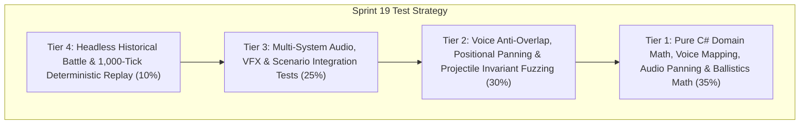

# Test Cases Catalog — Sprint 19: Audio Soundscape, Unit Voice Barks, Combat VFX & v1.2.0 Desktop Release

## 1. Scope & Test Pyramid Overview

This catalog defines the pre-implementation test matrix for **Sprint 19**, validating authentic Celtic and Roman unit voice barks with context speech and anti-overlap cooldowns, 2D positional combat audio and adaptive dynamic soundtrack crossfading, ballistic projectile physics with arched trajectories and ground shadows, combat impact sparks/blood splash VFX, golden level-up bursting rune rings, an authored Gauls vs Romans historical battle scenario with Town Center victory/defeat conditions, match result MVP statistics aggregation, and v1.2.0 standalone release packaging.

---

## 2. Test Case Matrix

### 2.1 Tier 1: Pure Domain & Math Unit Tests

| Test ID | Test Method / Scope | Preconditions | Inputs / Actions | Expected Results |
|:---|:---|:---|:---|:---|
| `TC_S19_001` | `UnitVoiceBark_SelectCommand_ReturnsContextVoiceLine` | Celtic Swordsman vs Roman Legionary | Evaluate `GetSelectionVoiceLine(unit, faction)` | Celtic returns Celtic phrase (*"Chieftain?", "Ready for battle!"*); Roman returns Roman phrase (*"Ave, Centurion!", "Legion ready!"*). |
| `TC_S19_002` | `UnitVoiceBark_AttackCommand_ReturnsAggressiveBark` | Combat unit given attack command | Evaluate `GetAttackVoiceLine(unit, faction)` | Returns battle cry (*"Charge!", "For glory!", "No mercy!"*). |
| `TC_S19_003` | `UnitVoiceBark_HeroAbility_ReturnsUniqueHeroicLine` | Hero Brennus casting *War Cry* / *Heroic Strike* | Evaluate `GetHeroAbilityVoiceLine(hero, ability)` | Returns heroic line (*"Feel our wrath!", "Feel my blade!"*). |
| `TC_S19_004` | `PositionalAudio_PanCalculation_MapsRelativeCameraXToNormalizedPan` | Camera at $(1000, 1000)$, sound at $(600, 1000)$ vs $(1400, 1000)$ | Evaluate `PositionalCombatAudioSystem.ComputePan(soundPos, camPos, viewportWidth)` | $(600, 1000) \to -0.5$ (Left pan); $(1400, 1000) \to +0.5$ (Right pan), clamped to $[-1.0, 1.0]$. |
| `TC_S19_005` | `PositionalAudio_DistanceAttenuation_AttenuatesWithDistance` | Camera at $(1000, 1000)$, sound at $(1000, 1000)$ vs $(1800, 1000)$ | Evaluate `ComputeVolumeAttenuation(soundPos, camPos, maxAudibleRange)` | Distance 0 $\to 1.0$ (Full volume); Distance 800 $\to \approx 0.2$ volume; Distance $\ge$ Max $\to 0.0$. |
| `TC_S19_006` | `ProjectilePhysics_ParabolicArc_ComputesHeightApexAtMidpoint` | Arrow fired from $(0, 0)$ to $(400, 0)$, flight duration 20 ticks | Evaluate `ComputeTrajectory(origin, target, progress)` at $t=0.5$ | Ground position is $(200, 0)$, Arc height $Z$ reaches peak apex $H_{\text{apex}}$, Ground shadow stays at $(200, 0)$. |
| `TC_S19_007` | `CombatVfx_MeleeHitSparks_GeneratesVelocityParticleDescriptors` | Melee strike dealing 35 damage | Evaluate `CombatVfxPresenter.CreateHitSparkDescriptors(pos, dir, damage)` | Emits spark particles with directional velocity bias and randomized scatter angles. |
| `TC_S19_008` | `CombatVfx_LevelUpRuneBurst_CalculatesExpandingRadiusAndAuraRing` | Unit achieves Level-Up to Level 5 | Evaluate `CombatVfxPresenter.CreateLevelUpRuneDescriptor(pos, level)` | Creates golden rune ring descriptor with expanding radius and rank-scaled intensity. |

### 2.2 Tier 2: Voice Anti-Overlap, Audio Panning & Projectile Invariant Tests

| Test ID | Test Method / Scope | Preconditions | Inputs / Actions | Expected Results |
|:---|:---|:---|:---|:---|
| `TC_S19_009` | `UnitVoiceBark_CooldownInterval_SuppressesRapidSuccessiveBarks` | Unit issues 5 move commands within 3 ticks | Call `TryTriggerVoiceBark(unit, CommandType.Move, tick)` for each | Exactly 1 voice bark triggered; subsequent 4 suppressed by anti-chatter cooldown. |
| `TC_S19_010` | `UnitVoiceBark_HeroPriorityDucking_HeroOverridesRegularBarks` | Regular unit speaking, Hero Brennus casts *War Cry* | Trigger hero bark | Hero bark interrupts/ducks regular chatter with priority override. |
| `TC_S19_011` | `PositionalAudio_ConcurrencyLimiter_LimitsIdenticalSoundsPerTick` | 20 simultaneous sword clashes on same tick | Process audio triggers through `PositionalCombatAudioSystem` | Capped to maximum $N$ concurrent instances (e.g. 4) to prevent audio bus clipping. |
| `TC_S19_012` | `AdaptiveMusic_DynamicCombatTransition_PeaceToBattleOnHighIntensity` | Simulation starts peaceful, combat intensity jumps to 0.85 | Call `AdaptiveMusicPresenter.Update(0.85f)` | Music transitions smoothly from `Peace` to `Battle` with crossfade metadata. |
| `TC_S19_013` | `AdaptiveMusic_DecayHysteresis_DelaysPeaceReturnAfterCombatEnds` | Combat ends (intensity drops to 0.0) | Update music presenter across consecutive ticks | Sustains battle/skirmish state for cooldown delay ticks before reverting to peace. |
| `TC_S19_014` | `ProjectilePhysics_FlightProgress_AdvancesDeterministicallyToTarget` | Catapult boulder with 30-tick flight | Advance physics ticks 0 through 30 | Progress advances strictly from $0.0 \to 1.0$; triggers impact event on final tick. |
| `TC_S19_015` | `CombatVfx_ParticleBuffer_ReusesRingBufferWithoutDynamicAllocations` | 100 hit events in succession | Push effects into `CombatVfxPresenter` | Ring buffer handles all descriptors without heap reallocation; count tracked accurately. |
| `TC_S19_016` | `MatchResult_OutcomeEvaluation_DeclaresVictoryWhenEnemyTownCenterDestroyed` | Roman Town Center destroyed (`FactionId.Player2`) | Evaluate match outcome | Match state transitions to `MatchOutcome.Victory` for Player 1. |

### 2.3 Tier 3: Multi-System Audio, VFX & Scenario Integration Tests

| Test ID | Test Method / Scope | Preconditions | Inputs / Actions | Expected Results |
|:---|:---|:---|:---|:---|
| `TC_S19_017` | `HistoricalBattleScenario_InitializesAuthoredBattlefield` | New `HistoricalBattleScenario` instance | Inspect armies, bases, river crossing, and forts | Celtic hill village in NW, Roman garrison in SE, river crossing with shallow ford, and defensive towers deployed. |
| `TC_S19_018` | `HistoricalBattleScenario_TownCenterDestructionTriggersDefeat` | Celtic Town Center destroyed (`FactionId.Player1`) | Simulate battle until Celtic TC destroyed | Match state transitions to `MatchOutcome.Defeat` for Player 1. |
| `TC_S19_019` | `MatchResultPresenter_AggregatesPostMatchMvpStats` | 200 ticks of battle with kills, training, and gathering | Generate match summary report via `MatchResultPresenter` | Accurately aggregates Total Kills, Units Lost, Resources Gathered, Match Duration, and MVP Hero Level. |
| `TC_S19_020` | `CombatAudio_GatheringEvents_TriggersWoodStoneAnvilSounds` | Villagers chopping wood, mining stone, forging weapons | Dispatch domain gathering & production events | Correct SFX cues (`WoodChop`, `StonePick`, `AnvilStrike`) queued with positional coordinates. |
| `TC_S19_021` | `CombatVfx_BloodSplashParticles_TriggersOnFleshCasualty` | Infantry unit takes lethal melee damage | Dispatch `UnitKilledEvent` | Emits blood splash particle decal at casualty coordinates. |
| `TC_S19_022` | `CombatVfx_BuildingDamageFireAndSmoke_ScalesWithDestruction` | Town Center at $25\%$ structural integrity | Query building VFX state | Heavy fire and billowing smoke particle emitters activated. |

### 2.4 Tier 4: Headless Scenario & Release Packaging Tests

| Test ID | Test Method / Scope | Preconditions | Inputs / Actions | Expected Results |
|:---|:---|:---|:---|:---|
| `TC_S19_023` | `HistoricalBattleScenario_FullMatchReplay_MaintainsBitForBitParity` | 2 independent seeded simulation runs (Seed 1904, 500 ticks) | Run dual simulation passes | State checksums match bit-for-bit with 0 state divergence. |
| `TC_S19_024` | `ReleasePipeline_V120Bundle_GeneratesValidPackageManifest` | Release pipeline invoked for v1.2.0 | Execute `PackageBundleGenerator.CreateBundle("1.2.0", ...)` | Generates valid manifest with SHA-256 hashes and all bundle assets accounted for. |
| `TC_S19_025` | `ReleasePerformance_V120Benchmark_MeetsAllFrameAndMemoryBudgets` | 500 ticks with 300 active combat units | Execute `ReleasePerformanceCertifier` | Mean tick $< 16.6$ ms, memory $< 500$ MB, zero hot-loop GC allocations verified. |

---

## 3. Pass / Fail Quality Criteria
- **100% Green Pass Rate:** All 25 test cases must pass with 0 failures, 0 errors, and 0 skipped tests.
- **Zero Regression:** All 388 historical tests must remain 100% passing.
- **Zero Allocations in Hot Loop:** Audio triggers, particle descriptors, and projectile physics step must produce 0 per-tick dynamic heap allocations.
