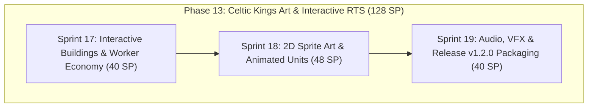

# Phase 13 — Celtic Kings 2D Sprite Art & Deep Interactive RTS

## 1. Objective
Transform Crown & Conquest into a visually stunning, fully interactive 2D historical RTS inspired by *Celtic Kings: Rage of War* and *Age of Empires II*. Implement complete settlement interactions (interactive building selection, training queues, rally flags, building placement ghost), authentic 2D multi-layer terrain tilesets, hand-crafted/illustrated building sprites, animated directional unit spritesheets (Idle, Walk, Attack, Death), dynamic line-of-sight Fog of War, unit voice barks, combat impact audio, and package the final polished release **v1.2.0**.

---

## 2. Sprint Roadmap Breakdown

### 2.1 Sprint 17 — Interactive Buildings, Production Queues & Worker Economy (40 SP)
- **Interactive Building Cards:** Left-clicking Town Center, Barracks, Blacksmith, Stables displays action cards with unit training and tech research buttons.
- **Production Queues:** Timed training progress bars, queue slots, cancellation refunds, and spawn dispatch.
- **Rally Point Flags:** Visual rally points placed on right-click; spawned units march to the rally point.
- **Worker Resource Gathering Loop:** Right-clicking resource nodes tasks villagers to harvest, plays gathering animations/timers, and carries resources back to drop-off points.
- **Building Placement Ghost:** Grid-aligned green/red blueprint preview for constructing new Houses, Barracks, Blacksmiths, and Watchtowers.
- **Population Housing Breakdown:** Dynamic housing capacity limits (+5 pop per House) and live HUD breakdown.

### 2.2 Sprint 18 — Celtic Kings 2D Sprite Art, Animated Units & Terrain (48 SP)
- **Rich 2D Terrain Tileset:** Multi-layered auto-tiling terrain system (lush Celtic grass, dirt paths, stone cliffs, water shorelines).
- **Illustrated Building Sprites:** Authentic Celtic and Roman structures (Thatched-roof Town Halls, Timber Barracks, Stone Blacksmith Forge with smoke, Watchtowers).
- **Animated Unit Spritesheets:** Directional 2D unit sprites (Swordsmen, Archers, Cavalry, Villagers, Hero Brennus, Roman Legionaries) with *Idle*, *Walk*, *Attack*, and *Death* animations.
- **Resource & Nature Sprites:** High-detail oak/pine trees, gold ore veins, stone rock formations, and iron deposits.
- **Dynamic Fog of War:** Line-of-sight exploration shroud and semi-transparent fog over non-visible map regions.

### 2.3 Sprint 19 — Sound Effects, Voice Barks, Combat VFX & Release v1.2.0 (40 SP)
- **Unit Voice Barks:** Historical Celtic and Roman audio responses on selection and movement orders.
- **Combat Impact SFX & Music:** Sword clashes, shield blocks, bow twangs, and dynamic orchestral Celtic battle music.
- **Combat VFX:** Slashing trails, arrow trajectory arcs with shadows, building fire/destruction stages.
- **Authored Gauls vs Romans Skirmish Map:** Hand-crafted battlefield with strategic chokepoints and victory/defeat screens.
- **Release Packaging v1.2.0:** Standalone graphical executable and WiX MSI installers with all sprites, audio, and animations bundled.

---

## 3. Definition of Done (DoD)
- [ ] Left-clicking buildings opens interactive production action cards.
- [ ] Training units deducts resources and spawns animated units at rally points.
- [ ] Villagers autonomously gather resources and deliver them to Town Centers.
- [ ] Vector circle/rectangle primitives replaced with textured 2D sprites and animated units.
- [ ] Terrain rendered using high-resolution 2D tilemaps with roads, water, and forests.
- [ ] Fog of War dynamically obscures unvisited/unseen areas.
- [ ] Unit orders play voice barks; combat engagements trigger impact SFX.
- [ ] Standalone `.exe` and `.msi` installers updated to version `v1.2.0`.
