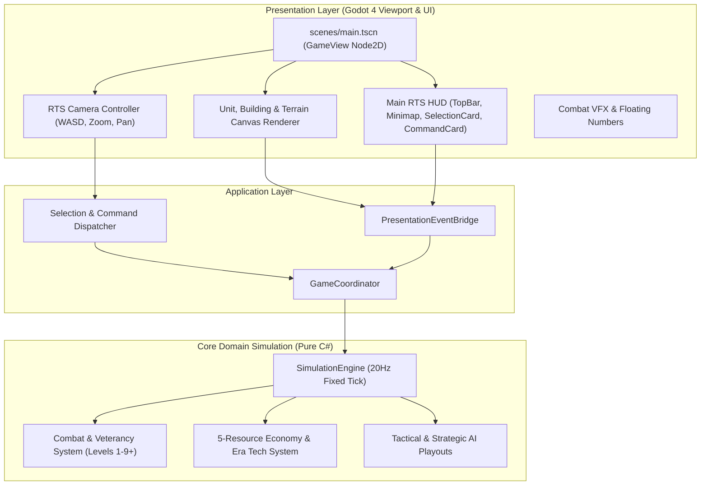

# Sprint 16 — Godot Visual Scene Assembly, 2D Graphical RTS Viewport & Desktop Packaging

## 1. Release Version & Metadata
- **Sprint Identifier:** Sprint 16 (Final Roadmap Milestone)
- **Target Release Version:** **`v1.1.0`**
- **Target Git Release Tag:** **`v1.1.0`**
- **Release Phase:** **Phase 12 — Full Graphical Presentation & Desktop Game Distribution**
- **Engine / Target Platform:** Godot 4.3+ (.NET 8 Mono) / Windows 10 & 11 (x64)

---

## 2. Sprint Goal
Assemble and deliver the complete **interactive 2D graphical desktop game** for Crown & Conquest in Godot 4. Players can launch `CrownConquest.exe` or install via `CrownConquest_1.1.0_x64_en-US.msi` to play a full visual RTS/RPG with real-time graphical viewport, animated unit tokens, faction heraldry, dynamic RTS HUD, mouse drag selection, minimap radar, hero ability casting, and full sound effects.

---

## 3. Sprint Effort & Capacity
- **Duration:** 7–10 working days
- **Planned Capacity:** **48 Story Points**
- **Primary Ownership:** **SDE (Dev Architect) + UI/Art Specialist + SDET (QA) + Release Engineer (DO)**
- **Operating Contract:** Strictly complies with [`AGENTS.md`](file:///c:/Workspace/CrownConquest/AGENTS.md) multi-agent operating rules, decoupled architecture, and zero hot-loop GC allocations.

---

## 4. Sprint Backlog & Story Slices

| ID | Story Slice | Primary Owner | SP | Scope & Deliverables |
|:---|:---|:---|:---:|:---|
| **CNC-1601** | **Godot Main Scene & 2D Graphical Viewport (`scenes/main.tscn`)** | SDE / ARCH | 6 | Setup `scenes/main.tscn` root `GameView : Node2D`, layered canvas structure (Terrain, Grid, Entities, VFX, FogOfWar, HUD CanvasLayer). |
| **CNC-1602** | **2D Visual Unit Rendering & Faction Heraldry** | Art / SDE | 5 | Visual unit tokens with Celtic Blue (`#2563EB`) and Roman Red (`#DC2626`) faction colors, heading direction indicators, animated attack flashes, health bars, and veterancy rank badges. |
| **CNC-1603** | **Settlement Buildings & Resource Node Visuals** | Art / SDE | 5 | Graphical rendering for Town Centers, Barracks, Blacksmiths, Stables, Watchtowers, Stone Walls, and Resource Nodes (Trees, Gold Mines, Stone Quarries, Iron Deposits). |
| **CNC-1604** | **Interactive RTS HUD & Mouse Drag Selection Box** | UI / SDE | 6 | Top Resource Bar (Food, Wood, Gold, Stone, Iron, Pop, Era), real-time Minimap radar with unit blips, bottom selection card with unit stats and XP bar, and green translucent mouse drag selection rectangle. |
| **CNC-1605** | **Command Card & RPG Hero Ability Buttons** | UI / SDE | 5 | Interactive Command Card with Move, Attack, Stop, Patrol, Formation buttons (Line, Wedge, Shield Wall), and clickable Hero abilities (War Cry, Heroic Strike) with live cooldown sweeps. |
| **CNC-1606** | **2D RTS Camera Controller & Input Navigation** | SDE | 5 | WASD / Arrow key panning, mouse wheel smooth zoom ($0.5\times$ to $3.0\times$), middle-mouse drag, edge panning, and right-click move/attack/gather command dispatching. |
| **CNC-1607** | **Combat Visual Impact VFX & Floating Text** | Art / SDE | 4 | Floating damage numbers, combat hit particles, level-up golden aura rings, building dust construction puffs, and arrow flight trajectories. |
| **CNC-1608** | **Graphical Presentation & Input Integration Tests** | SDET / QA | 6 | Automated test suite verifying screen-to-world coordinate projections, input command bridge, HUD viewmodel binding, and deterministic simulation synchronization. |
| **CNC-1609** | **Godot Desktop Export & Windows Release Packaging (v1.1.0)** | Release / DO | 6 | Export standalone graphical game (`CrownConquest.exe` + `.pck`), package WiX MSI installer (`CrownConquest_1.1.0_x64_en-US.msi`), create portable zip, generate SHA-256 `checksums.txt`, and publish GitHub Release `v1.1.0`. |

---

## 5. Architectural Alignment & Layering

---

## 6. Definition of Done (DoD) for Sprint 16
- [x] **Full Graphical Viewport:** Double-clicking `CrownConquest.exe` launches a rich 1920x1080 graphical window (not a console terminal).
- [x] **Interactive Gameplay:** Players can drag-select units, right-click to move/attack, harvest 5 resources, construct buildings, and cast hero abilities.
- [x] **Visual Feedback:** Units display health bars, faction colors, and veterancy rank badges (Bronze, Silver, Gold, Legendary Crown).
- [x] **Zero Regressions:** Cumulative automated test suite remains 100% green (`dotnet test`).
- [x] **Performance Budget:** Maintains 60 FPS ($< 16.6\text{ ms}$ frame budget) and $< 500\text{ MB}$ RAM footprint.
- [x] **Distribution Packaging:** Clean Windows Installer (`.msi`), standalone setup executable (`.exe`), portable zip (`.zip`), and SHA-256 `checksums.txt` published to GitHub Release `v1.1.0`.
